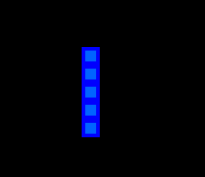
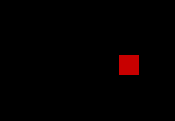

# AI-Trained Snake Game with Deep Q-Learning

This project implements an AI agent trained using Deep Q-Learning to play the classic Snake game. The agent learns to navigate the snake to eat food while avoiding collisions with itself and the game boundaries. The game environment is built using PyGame, and the neural network model is implemented with PyTorch.

## Table of Contents

- [Overview](#overview)
- [Gameplay](#gameplay)
- [Game Components](#game-components)
- [Features](#features)
- [Installation](#installation)
- [Usage](#usage)
- [Configuration](#configuration)
- [Training](#training)
- [Model Architecture](#model-architecture)
- [Results](#results)
- [Challenges](#challenges)
- [Credits](#credits)

## Overview

This project demonstrates how an AI agent can be trained to master the game of Snake using reinforcement learning, specifically Deep Q-Learning. By leveraging PyTorch for the neural network and PyGame for the game interface, this project provides a hands-on example of AI in gaming.

## Gameplay


## Game Components

- **Snake**: 
- **Food**: 
- **Score**: 

## Features

- **Snake Game Environment:**
  A fully functional Snake game built with PyGame.
- **Deep Q-Learning AI:**
  Implements the DQN algorithm for training.

- **Visualization:**
  Displays training progress, including scores and agent behavior.

- **AI Agent:**
  An AI agent that learns to play Snake using a neural network.

- **Customizablility:**
  Easy to adjust hyperparameters and observe the impact on performance.

## Installation

Follow these steps to set up and run the project on your local machine.

### Prerequisites

Make sure you have the following installed:

- **Python 3.x**
- **pip** (Python package installer)
- **PyGame**
- **PyTorch**

### Steps

1. **Clone the Repository:**

   Clone this repository to your local machine:

   ```bash
   git clone https://github.com/your-username/AI-snake-game.git
   cd AI-snake-game

   ```

2. **Install Dependencies:**
   ```bash
   pip install -r requirements.txt
   ```

### Usage

To train the AI agent and watch it play Snake game:

```bash
python agent.py
```

The game will start, and you can observe the AI's gameplay and training progress through the console and any plotted metrics.

## Configuration

The training parameters and game settings can be adjusted in the agent.py and snake_game.py files. Key parameters include:

- **Learning Rate:**
  Controls how much the model adjusts based on the error. Higher values lead to faster learning but can cause instability.
- **Gamma:**
  The discount factor for future rewards. A higher gamma values the future rewards more.

- **Batch Size:**
  Number of experiences used for each update of the model.

## Training

The AI is trained using the Deep Q-Learning algorithm, where it learns by interacting with the game environment, storing experiences, and updating its policy based on rewards received.

## Model Architecture

The model consists of a simple feedforward neural network with the following layers:

- **Input Layer:**
  Accepts the game state.
- **Hidden Layer:**
  Processes the input features.

- **Output Layer:**
  Predicts the best action to take (e.g., move up, down, left, or right).

## Results

The AI agent demonstrates the ability to play Snake autonomously, gradually improving its score as training progresses. However, certain challenges such as the snake circling in the same area persist.

## Challenges

- **Circular Behavior:**
  The AI sometimes learns to move in circles without improving its score. This issue can be mitigated by tweaking the reward structure or introducing penalties for such behavior.
- **Balancing Exploration and Exploitation:**
  Adjusting the epsilon-greedy strategy to balance exploration (trying new actions) and exploitation (choosing known good actions) is crucial for effective learning.

## Credits

This project is inspired by OpenAI's reinforcement learning techniques and incorporates ideas from various Deep Q-Learning resources.

And special thanks to FreeCodeCamp.org -->
[Watch the Video](https://youtu.be/L8ypSXwyBds?si=mVKFI6mhNj3GREQd)
